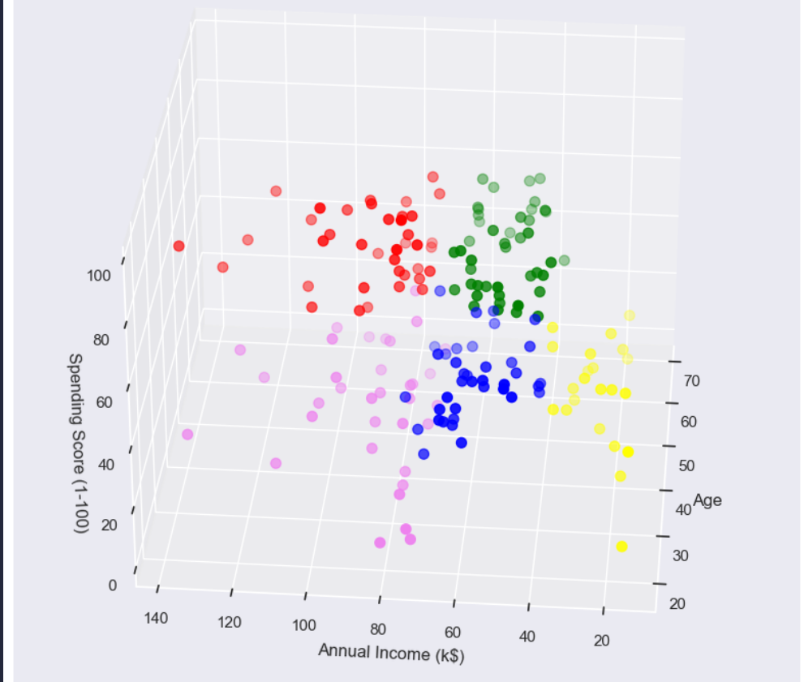
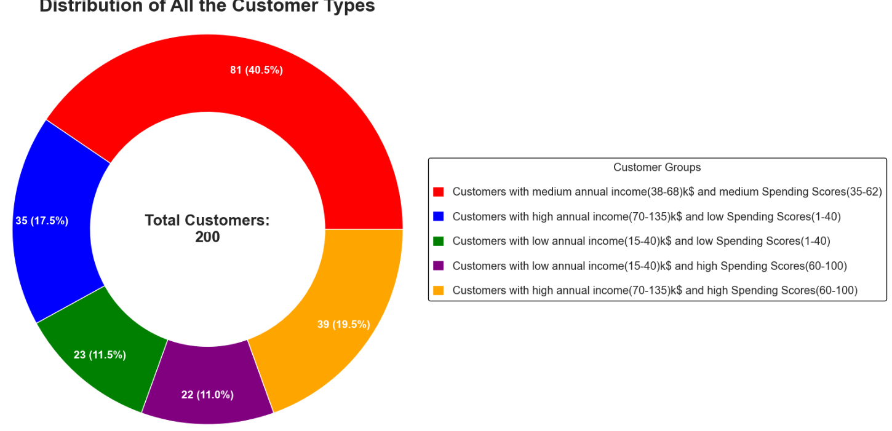

# Samay Shetty
## Glowlogics Project

---

# Customer Segmentation using K-Means Clustering

## Project Overview

This project applies the K-Means Clustering algorithm to segment mall customers into distinct groups based on their age, annual income, and spending behavior. By identifying patterns in customer data, businesses can better understand their customer base and design targeted marketing strategies for each segment.

The project runs three separate clustering experiments — using Age vs Spending Score, Annual Income vs Spending Score, and a 3D combination of all three features — to explore customer groupings from multiple angles.

---

## Objectives

- Segment mall customers into meaningful groups using unsupervised learning
- Identify distinct customer profiles based on spending behavior and income
- Determine the optimal number of clusters using the Elbow Method and Silhouette Score
- Visualize customer segments in 2D and 3D for clear business interpretation
- Provide actionable insights to guide marketing and business strategy

---

## Problem Statement

Mall management and retail businesses often struggle to:

- Understand who their customers are beyond basic demographics
- Identify high-value customers who spend frequently
- Distinguish between customers who earn high incomes but spend conservatively
- Personalize promotions and offers without knowing spending patterns

This project solves that by grouping customers automatically into segments, making it easy to identify the right audience for each marketing approach.

---

## Dataset

| Property | Details |
|----------|---------|
| Source | Mall Customers dataset (Mall_Customers.csv) |
| Total Records | 200 customers |
| Total Features | 5 columns |
| Missing Values | None |
| Duplicates | None |

### Feature Columns

| Column | Type | Description |
|--------|------|-------------|
| CustomerID | Integer | Unique identifier for each customer |
| Gender | Categorical | Male or Female |
| Age | Integer | Customer age in years (18–70) |
| Annual Income (k$) | Integer | Annual income in thousands of dollars (15–137) |
| Spending Score (1-100) | Integer | Mall-assigned score based on spending behavior (1–99) |

### Statistical Summary

| Feature | Min | Max | Mean | Std Dev |
|---------|-----|-----|------|---------|
| Age | 18 | 70 | 38.85 | 13.97 |
| Annual Income (k$) | 15 | 137 | 60.56 | 26.26 |
| Spending Score | 1 | 99 | 50.20 | 25.82 |

---

## Technologies Used

| Tool / Library | Purpose |
|---------------|---------|
| Python 3.11+ | Core programming language |
| Pandas | Data loading and exploration |
| NumPy | Numerical operations |
| Matplotlib | Plotting charts and cluster visualizations |
| Seaborn | Statistical visualization (violin plots, histograms, bar charts) |
| Scikit-Learn | K-Means clustering and Silhouette Score evaluation |
| Jupyter Notebook | Interactive development environment |

---

## Installation

**Step 1 — Clone the repository**

```bash
git clone https://github.com/samayshetty/customer-segmentation.git
cd customer-segmentation
```

**Step 2 — Create a virtual environment**

```bash
python -m venv venv
source venv/bin/activate        # macOS / Linux
venv\Scripts\activate           # Windows
```

**Step 3 — Install required libraries**

```bash
pip install pandas numpy matplotlib seaborn scikit-learn jupyter
```

**Step 4 — Launch the notebook**

```bash
jupyter notebook customer_segmentation.ipynb
```

**Step 5 — Run all cells**

Go to Kernel → Restart & Run All

> Make sure `Mall_Customers.csv` is placed in the same folder as the notebook before running.

---

## How It Works

The project follows a structured 6-step pipeline:

**Step 1 — Data Gathering**
Load the Mall Customers CSV file into a Pandas DataFrame for analysis.

**Step 2 — Data Assessing**
Inspect the dataset using `.head()`, `.tail()`, `.describe()`, `.info()`, `.isnull().sum()`, and `.duplicated().sum()` to understand structure, data types, and quality. The dataset is clean with no missing values or duplicate records.

**Step 3 — Data Analysis and Exploration (EDA)**
Visualize distributions and relationships in the data:
- Bar chart of Annual Income distribution by Spending Score
- Histogram distributions for all four features
- Count plot of Gender distribution
- Violin plots comparing Age, Annual Income, and Spending Score by Gender
- Bar charts grouping customers by age range and spending score range
- Scatter plot of Annual Income vs Spending Score

**Step 4 — Feature Selection**
Three different feature combinations are tested for clustering:
- Combination 1: Age + Spending Score (2D)
- Combination 2: Annual Income + Spending Score (2D)
- Combination 3: Age + Annual Income + Spending Score (3D)

**Step 5 — Model Building**
The K-Means algorithm is applied with k values ranging from 2 to 10. Two methods are used to find the optimal k:
- Silhouette Score — measures how well-separated the clusters are
- Elbow Method — plots WCSS (Within Cluster Sum of Squares) against k to find the bend point

**Step 6 — Prediction and Visualization**
Once the optimal k is selected, the final model is trained and customers are labeled with their cluster. Results are visualized as 2D scatter plots with centroids and a full 3D cluster plot for the three-feature model.

---

## Clustering Approach

### What is K-Means Clustering?

K-Means is an unsupervised machine learning algorithm that partitions data into k groups. Each customer is assigned to the nearest cluster center (centroid), and centroids are iteratively adjusted until the groupings stabilize.

### Initialization Method

`k-means++` is used for smarter centroid initialization, which speeds up convergence and avoids poor local minima compared to random initialization.

### Choosing the Optimal k

**Elbow Method** — WCSS decreases as k increases. The optimal k is where the rate of decrease sharply slows down, forming an "elbow" shape in the graph.

**Silhouette Score** — Scores closer to 1.0 indicate well-separated, compact clusters. The k value with the highest silhouette score is preferred.

### Final k Values Selected

| Feature Combination | Optimal Clusters (k) |
|--------------------|----------------------|
| Age + Spending Score | 4 |
| Annual Income + Spending Score | 5 |
| Age + Annual Income + Spending Score | 6 |

---

## Results & Customer Segments

### Segmentation 1 — Age vs Spending Score (4 Clusters)

| Cluster | Age Range | Spending Score | Profile |
|---------|-----------|---------------|---------|
| 1 (Red) | 42–70 | 35–60 | Older customers, moderate spenders |
| 2 (Blue) | 18–40 | 60–100 | Young customers, high spenders |
| 3 (Green) | 18–40 | 65–100 | Young customers, very high spenders |
| 4 (Purple) | 18–42 | 30–65 | Young customers, average spenders |

### Segmentation 2 — Annual Income vs Spending Score (5 Clusters)

| Cluster | Annual Income | Spending Score | Profile |
|---------|--------------|---------------|---------|
| 1 | High (70–135k) | High (60–100) | Premium customers — ideal loyalty targets |
| 2 | High (70–135k) | Low (1–40) | Wealthy but cautious spenders |
| 3 | Medium (40–70k) | Medium (40–60) | Average customers — the largest group (~39%) |
| 4 | Low (15–40k) | Low (1–40) | Budget-conscious customers |
| 5 | Low (15–40k) | High (60–100) | Low income but high spending — impulsive buyers |

### Segmentation 3 — Age + Annual Income + Spending Score (6 Clusters, 3D)

Adds a third dimension to reveal deeper behavioral patterns that 2D clustering cannot distinguish. The 3D scatter plot allows visual inspection of how age, income, and spending interact together across all six segments.

### Cluster Size Distribution (Annual Income vs Spending Score)

| Segment | Proportion |
|---------|-----------|
| Average income, average spending | ~39% (largest group) |
| High income, high spending | ~17% |
| High income, low spending | ~18% |
| Low income, high spending | ~12% |
| Low income, low spending | ~12% |

---

## Key Insights

**Cluster 1 — High Income, High Spenders (Premium Customers)**
These are the most valuable customers. They earn well and spend freely. Best targets for premium memberships, exclusive offers, and loyalty programs.

**Cluster 2 — High Income, Low Spenders (Cautious Wealthy)**
Earning high but not spending in proportion. These customers may need targeted incentives, personalized discounts, or quality-focused messaging to unlock their spending potential.

**Cluster 3 — Average Income, Average Spending (Core Customers)**
The largest segment at ~39%. They represent the typical mall-goer. Broad promotions, seasonal offers, and general campaigns work best here.

**Cluster 4 — Low Income, High Spenders (Impulsive Buyers)**
Spending beyond their income level. Likely younger customers. Flash sales, trending products, and buy-now-pay-later offers resonate well with this group.

**Cluster 5 — Low Income, Low Spenders (Budget Shoppers)**
Price-sensitive customers. Discounts, value-for-money deals, and clearance sales are the most effective engagement tools.

**Age Insight**
Younger customers (18–40) are split between very high and average spenders. Older customers (42+) tend to cluster in moderate spending ranges regardless of income.

**Gender Insight**
The dataset contains slightly more female customers than male, and violin plots show similar spending score distributions between genders, meaning gender alone is not a strong differentiator for clustering.

---

## Project Structure

```
customer-segmentation/
│
├── customer_segmentation.ipynb    Main Jupyter Notebook
├── Mall_Customers.csv             Customer dataset (200 records)
└── README.md                      Project documentation
```

---

# 📊 Project Outputs

This section contains visualizations and results generated from the project.

## 🔍 Visualizations

- 📈 
- 🏥 
- 🔢  Customer Segmentation CSV OUTPUT

This Customer Segmentation project successfully identifies distinct customer groups within a mall dataset using K-Means Clustering. By testing multiple feature combinations and using both the Elbow Method and Silhouette Score to validate cluster counts, the project delivers reliable, interpretable segments.

The five-cluster Income vs Spending Score model provides the most actionable business insight — clearly separating premium customers, cautious high earners, average shoppers, impulsive buyers, and budget customers into groups that can each be targeted with a tailored strategy.

Businesses that act on these segments can improve marketing ROI, increase customer retention, and allocate promotional budgets more effectively.

---

*Made by Samay Shetty | Glowlogics*